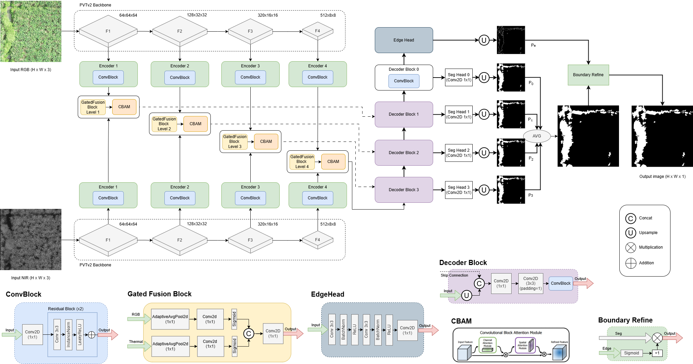

# SWNet: A Cross-Spectral Network for Camouflaged Weed Detection
This paper presents SWNet, a bimodal end-to-end cross-spectral network specifically engineered for the detection of camouflaged weeds in dense agricultural environments. Plant camouflage, characterized by homochromatic blending where invasive species mimic the phenotypic traits of primary crops, poses a significant challenge for traditional computer vision systems. To overcome these limitations, SWNet utilizes a Pyramid Vision Transformer v2 backbone to capture long-range dependencies and a Bimodal Gated Fusion Module to dynamically integrate Visible and Near-Infrared information. By leveraging the physiological differences in chlorophyll reflectance captured in the NIR spectrum, the proposed architecture effectively discriminates targets that are otherwise indistinguishable in the visible range. Furthermore, an Edge-Aware Refinement module is employed to produce sharper object boundaries and reduce structural ambiguity. Experimental results on the Weeds-Banana dataset indicate that SWNet outperforms ten state-of-the-art methods. The study demonstrates that the integration of cross-spectral data and boundary-guided refinement is essential for high segmentation accuracy in complex crop canopies. The code is available on GitHub: https://cod-espol.github.io/SWNet/.

# Architecture
Overall proposed architecture.

 <br>


# Citation
If you use the SWNet, please cite the following paper
```
 @inproceedings{velesaca2026swnet,
  title={SWNet: A Cross-Spectral Network for Camouflaged Weed Detection},
  author={Velesaca, Heny O and Miranda, Luigi and Sappa, Angel},
  booktitle={Proceedings of the IEEE/CVF conference on computer vision and pattern recognition workshops},
  pages={1--8},
  year={2026}
}    
```
